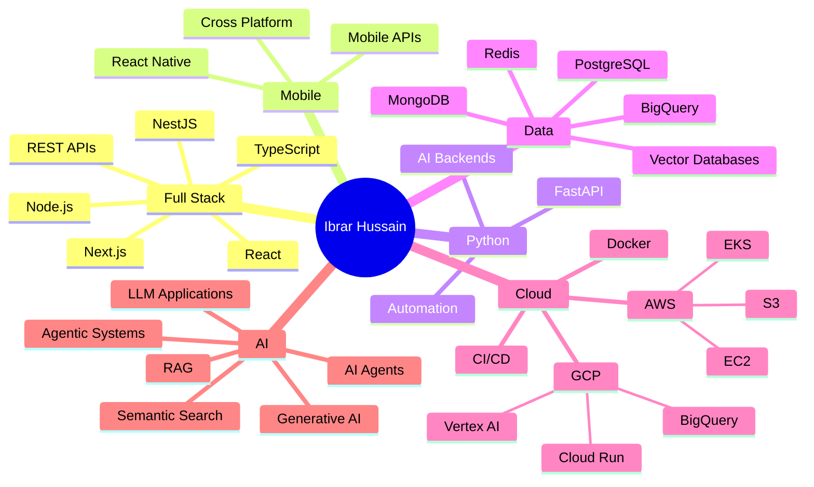

````markdown
<div align="center">


</div>

---

<div align="center">

### ⚡ What I'm Building

<table>
<tr>

<td align="center" width="25%">
<br/>
<b>Full Stack Systems</b><br/>
<sub>Web apps, APIs & scalable platforms</sub>
</td>

<td align="center" width="25%">
<br/>
<b>Mobile Applications</b><br/>
<sub>Cross-platform apps with React Native</sub>
</td>

<td align="center" width="25%">
<br/>
<b>AI Applications</b><br/>
<sub>LLMs, RAG & intelligent workflows</sub>
</td>

<td align="center" width="25%">
<br/>
<b>Cloud Systems</b><br/>
<sub>AWS, GCP, Docker & CI/CD</sub>
</td>

</tr>
</table>

</div>

---

## 🚀 About Me

```python
class FullStackDeveloper:
    def __init__(self):
        self.name = "Ibrar Hussain"
        self.role = "Full Stack Developer"
        self.languages = ["JavaScript", "TypeScript", "Python"]

        self.specialization = [
            "Web Development",
            "Mobile Development",
            "Backend Engineering",
            "Cloud Infrastructure",
            "AI Applications"
        ]

        self.current_focus = [
            "Generative AI",
            "RAG",
            "AI Agents",
            "Agentic Systems",
            "Scalable Cloud Applications"
        ]

    def engineering_mindset(self):
        return [
            "Build for scale",
            "Keep systems maintainable",
            "Automate repetitive work",
            "Ship production-ready software"
        ]


me = FullStackDeveloper()
```

> I enjoy working across the stack — from **React interfaces and React Native apps** to **Node.js / Python backends, databases, cloud infrastructure, and AI-powered systems**.

---

# 🛠️ Tech Arsenal

<div align="center">

### 💻 Languages


### 🌐 Frontend & Mobile


### ⚙️ Backend


### 🗄️ Databases & Data


<br/>

`Vector Databases` • `BigQuery`

### ☁️ Cloud & Infrastructure


<br/>

`EC2` • `EKS` • `S3` • `Cloud Run` • `Vertex AI` • `BigQuery`

### 🤖 AI & Intelligent Systems

<table>
<tr>
<td align="center" width="20%">
<br/>
<b>Generative AI</b><br/>
<sub>LLM-powered applications</sub>
</td>

<td align="center" width="20%">
<br/>
<b>RAG</b><br/>
<sub>Retrieval & semantic search</sub>
</td>

<td align="center" width="20%">
<br/>
<b>AI Agents</b><br/>
<sub>Tool-using AI workflows</sub>
</td>

<td align="center" width="20%">
<br/>
<b>Agentic Systems</b><br/>
<sub>Multi-step intelligent workflows</sub>
</td>

<td align="center" width="20%">
<br/>
<b>Vector Search</b><br/>
<sub>Embeddings & retrieval</sub>
</td>
</tr>
</table>

### 🧰 Tools & Workflow


</div>

---

# 🎯 Where I Spend My Time

<div align="center">

| 🧩 Area | 🔧 Focus |
|:---:|:---|
| 🌐 **Web** | React • Next.js • TypeScript |
| 📱 **Mobile** | React Native |
| ⚙️ **Backend** | Node.js • Express • NestJS • FastAPI |
| 🐍 **Python** | APIs • Automation • AI Applications |
| 🗄️ **Data** | PostgreSQL • MongoDB • Redis • BigQuery |
| 🤖 **AI** | LLMs • RAG • AI Agents • Agentic Systems |
| ☁️ **Cloud** | AWS • GCP • Cloud Run • Vertex AI |
| 🚢 **Delivery** | Docker • CI/CD • Production Infrastructure |

</div>

---

# 🧠 Engineering Focus

<div align="center">



</div>

---

# 🏗️ How I Think About Building Software

```text
                         ┌────────────────────┐
                         │       IDEA         │
                         └─────────┬──────────┘
                                   │
                                   ▼
                         ┌────────────────────┐
                         │     PRODUCT        │
                         │      DESIGN        │
                         └─────────┬──────────┘
                                   │
                    ┌──────────────┼──────────────┐
                    ▼              ▼              ▼
               ┌─────────┐   ┌─────────┐   ┌──────────┐
               │   WEB   │   │ MOBILE  │   │   API    │
               │ React   │   │   RN    │   │ Node/Py  │
               └────┬────┘   └────┬────┘   └────┬─────┘
                    │             │             │
                    └─────────────┼─────────────┘
                                  ▼
                         ┌────────────────────┐
                         │    DATA LAYER      │
                         │ PG • Mongo • Redis │
                         └─────────┬──────────┘
                                   │
                    ┌──────────────┴──────────────┐
                    ▼                             ▼
             ┌──────────────┐             ┌──────────────┐
             │ CLOUD / OPS  │             │   AI LAYER   │
             │ AWS / GCP    │             │ LLM / RAG    │
             │ Docker / CI  │             │ Agents       │
             └──────────────┘             └──────────────┘
```

---

# 📊 Professional Snapshot

<div align="center">

<table>
<tr>

<td align="center" width="25%">
<br/>
<b>6+ Years</b><br/>
<sub>Software Engineering</sub>
</td>

<td align="center" width="25%">
<br/>
<b>JavaScript + Python</b><br/>
<sub>Primary Languages</sub>
</td>

<td align="center" width="25%">
<br/>
<b>Web + Mobile + Cloud</b><br/>
<sub>End-to-End Development</sub>
</td>

<td align="center" width="25%">
<br/>
<b>AI & Agents</b><br/>
<sub>Current Exploration</sub>
</td>

</tr>
</table>

</div>

---

# 🔥 What I'm Exploring Now

<div align="center">

### 🤖 AI → From Features to Systems

`LLM Applications` → `RAG` → `Tool Calling` → `Memory` → `AI Agents` → `Agentic Workflows`

### ☁️ Cloud → From Deployment to Architecture

`Docker` → `CI/CD` → `AWS` → `GCP` → `Scalable Services` → `Production Infrastructure`

### ⚙️ Engineering → From Code to Product

`Architecture` → `APIs` → `Data` → `Observability` → `Automation` → `Reliable Systems`

</div>

---

# 🤝 Open to Collaborate On

<div align="center">

| 🚀 Domain | 💡 Ideas |
|:---:|:---|
| 🤖 **AI Applications** | LLM-powered products & intelligent workflows |
| 🧠 **Agentic Systems** | AI agents, tools, memory & automation |
| 🔎 **RAG Systems** | Knowledge bases, semantic search & retrieval |
| 🌐 **Full Stack Products** | SaaS, dashboards, APIs & platforms |
| 📱 **React Native** | Cross-platform mobile products |
| ☁️ **Cloud Engineering** | AWS/GCP infrastructure & deployments |
| 🛠️ **Developer Tools** | Automation, APIs & engineering utilities |

</div>

---

# 📈 GitHub Activity

<div align="center">


</div>

---

# 📊 GitHub Analytics

<div align="center">


</div>

---

# 🏆 GitHub Trophies

<div align="center">


</div>

---

# 🌐 Let's Connect

<div align="center">

<a href="https://github.com/ibrar-web">

</a>

<a href="https://www.linkedin.com/">

</a>

</div>

---

# 👀 Profile Activity

<div align="center">


</div>

---

# 🐍 Contribution Snake

<div align="center">

<picture>
  <source media="(prefers-color-scheme: dark)" srcset="https://raw.githubusercontent.com/ibrar-web/ibrar-web/output/github-contribution-grid-snake-dark.svg">
  <source media="(prefers-color-scheme: light)" srcset="https://raw.githubusercontent.com/ibrar-web/ibrar-web/output/github-contribution-grid-snake.svg">
  
</picture>

</div>

---

<div align="center">


### 💼 Full Stack Developer • JavaScript • Python • Cloud • AI

**Build useful things. Ship them. Keep learning. 🚀**

</div>
````
