<div align="center">


</div>

---

<div align="center">

<table>
<tr>
<td align="center" width="33%">

### 🌐 Full Stack
React · Next.js · Node.js<br/>
Scalable web applications & APIs

</td>
<td align="center" width="33%">

### 📱 Mobile
React Native<br/>
Cross-platform applications

</td>
<td align="center" width="33%">

### 🤖 AI + Cloud
LLMs · RAG · Agents · AWS · GCP<br/>
Intelligent & cloud-native systems

</td>
</tr>
</table>

</div>

---

# 👋 About Me

```python
class IbrarHussain:
    name = "Ibrar Hussain"
    role = "Full Stack Developer"

    languages = [
        "JavaScript",
        "TypeScript",
        "Python"
    ]

    focus = [
        "Web Development",
        "Mobile Development",
        "Backend Engineering",
        "Cloud Engineering",
        "AI & Agentic Applications"
    ]

    currently_exploring = [
        "Generative AI",
        "LLM Applications",
        "RAG",
        "AI Agents",
        "Agentic Systems"
    ]

    mindset = "Build → Ship → Learn → Improve"
```

I build across the stack — from **React interfaces and React Native applications** to **Node.js and Python backends, databases, cloud infrastructure, and AI-powered systems**.

---

# 🛠️ Tech Arsenal

<div align="center">

### 💻 Languages


<br/><br/>

### 🎨 Frontend & Mobile


<br/><br/>

### ⚙️ Backend


<br/><br/>

### 🗄️ Databases


<br/>

`Vector Databases` · `BigQuery`

<br/><br/>

### ☁️ Cloud & Infrastructure


<br/>

`EC2` · `EKS` · `S3` · `Cloud Run` · `Vertex AI`

<br/><br/>

### 🤖 AI & Intelligent Systems

`Generative AI` · `LLM Applications` · `RAG` · `AI Agents` · `Agentic Systems` · `Vector Search`

<br/><br/>

### 🔧 Tools


</div>

---

# 🚀 What I Build

<div align="center">

<table>
<tr>
<td align="center" width="25%">

### 🌐
**Web**

SaaS platforms<br/>
Dashboards<br/>
Business applications<br/>
REST APIs

</td>
<td align="center" width="25%">

### 📱
**Mobile**

React Native apps<br/>
Cross-platform products<br/>
Mobile backends<br/>
Production apps

</td>
<td align="center" width="25%">

### ☁️
**Cloud**

AWS / GCP<br/>
Dockerized services<br/>
CI/CD pipelines<br/>
Scalable infrastructure

</td>
<td align="center" width="25%">

### 🤖
**AI**

LLM applications<br/>
RAG systems<br/>
AI agents<br/>
Agentic workflows

</td>
</tr>
</table>

</div>

---

# 🧠 Current Focus

<div align="center">

### From Full Stack → Intelligent Systems

```text
LLMs
 ↓
RAG & Retrieval
 ↓
Tool Calling
 ↓
Memory & Context
 ↓
AI Agents
 ↓
Agentic Workflows
 ↓
Production Applications
```

I’m focused on turning AI capabilities into useful production applications, especially **RAG, tools, agents, and agentic workflows**.

</div>

---

# 🏗️ Engineering Across the Stack

<div align="center">

| Layer | Technologies |
|:---|:---|
| **Frontend** | React · Next.js · TypeScript |
| **Mobile** | React Native |
| **Backend** | Node.js · Express · NestJS · FastAPI |
| **Languages** | JavaScript · TypeScript · Python |
| **Data** | PostgreSQL · MongoDB · Redis · BigQuery |
| **AI** | LLMs · RAG · Agents · Vector Search |
| **Cloud** | AWS · GCP · Cloud Run · Vertex AI |
| **Infrastructure** | Docker · Kubernetes · CI/CD |

</div>

---

# 💡 Areas of Interest & Collaboration

<div align="center">

<table>
<tr>
<td align="center" width="25%">

### 🤖 AI & Agents

LLM applications<br/>
RAG pipelines<br/>
AI agents<br/>
Agentic workflows

</td>
<td align="center" width="25%">

### 🌐 Full Stack

SaaS products<br/>
Scalable APIs<br/>
Web platforms<br/>
Backend systems

</td>
<td align="center" width="25%">

### 📱 Mobile

React Native<br/>
Cross-platform apps<br/>
Mobile APIs<br/>
Production apps

</td>
<td align="center" width="25%">

### ☁️ Cloud

AWS & GCP<br/>
Docker & CI/CD<br/>
Cloud-native systems<br/>
Scalable infrastructure

</td>
</tr>
</table>

</div>

---

# 📊 GitHub Activity

<div align="center">



</div>

---

# 📈 GitHub Analytics

<div align="center">




</div>

---

# 🏆 GitHub Trophies

<div align="center">


</div>

---

# ⚡ One-Liner

<div align="center">

> **“From JavaScript and Python to AI and cloud — I turn ideas into production-ready systems.”**

</div>

---

# 🌐 Connect With Me

<div align="center">

<a href="https://github.com/ibrar-web">

</a>

<a href="https://www.linkedin.com/">

</a>

<br/><br/>


</div>

---

<div align="center">

### 💼 Open to opportunities • 🚀 Let's build useful things

**JavaScript · Python · Full Stack · Cloud · AI**


</div>
